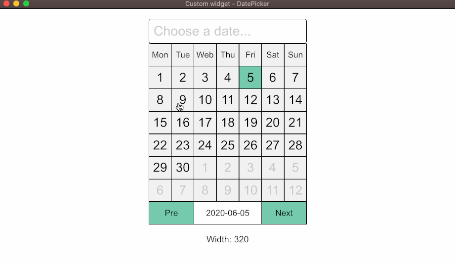
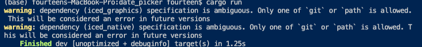

## Custom widget - DatePicker



### Run steps

run it with `cargo run`:
```
cargo run
```
### About warning



>```[warning]```: This warning is because our widget depends on two sub folder of **Iced**. However, **Iced** doesn't export these two modules. The version of these two crates in crates.io is also too old to use, so we have to use ```git + path``` to specify the version and location. In the future, this warning can be esasily removed by bumping the versions of **Iced**, **Iced_native**, and **Iced_graphics**.

### Denpendencies

- [Iced: 94af34884667e78e231fb1904ae3e9fa785c9a7a](https://github.com/hecrj/iced/tree/94af34884667e78e231fb1904ae3e9fa785c9a7a)

### License - TODO

[`main`]: src/main.rs
